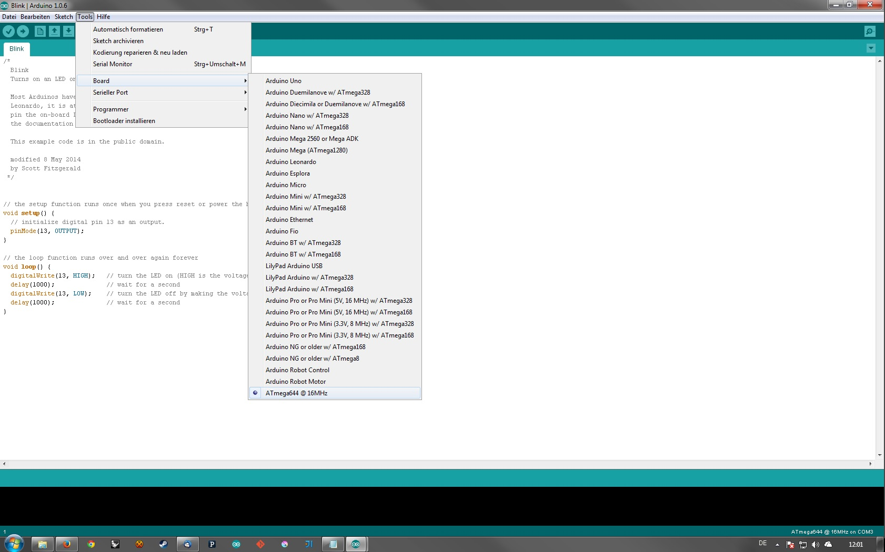

# arduino-644-core
All you need for running Arduino Core on an ATmega644

These are the pin and board definitions you need to run Arduino core on non Arduino AVR ATmega644.

# Installation
Copy the hardware folder into your arduino sketchbook directory.
After the next restart of your arduino IDE the 644 should be listed in "tools/board".



# CODE
You might need to include Arduino.h and there seems to be a problem with setting up the timer registers of the 644 via the arduino core.
As a workaround just set the timer registers again inside setup:

```cpp
void setup()
{
  //setup timers
  cli();

  TCCR0A = B00000011;
  TCCR0B = B00000011;
  TIMSK0 = B00000001;

  TCCR1A = B10100001;
  TCCR1B = B00000011;

  TCCR2A = B00000001;
  TCCR2B = B00000100;

  TIMSK1 = B00000000;

  sei();
}
```

# Flash
There are 3 options on how to flash your 644:

* either you grab a bootloader allowing you to flash your device via UART (the arduino way)
* or you don't have a bootloader at all and flash via ISP (the rough way)
* or you use the ethersex Ethernet bootloader (the right way)

# Ethersex (E6)
If you choose to use E6 to programm your 644 you will need ethernet connectivity.
Check out ENC28J60 breakout boards to give your 644 network access.
Upon reboot the controller will try to grab a specified file from a TFTP server in your network and flash itself.

See http://www.ethersex.de/index.php/Main_Page for more information.
